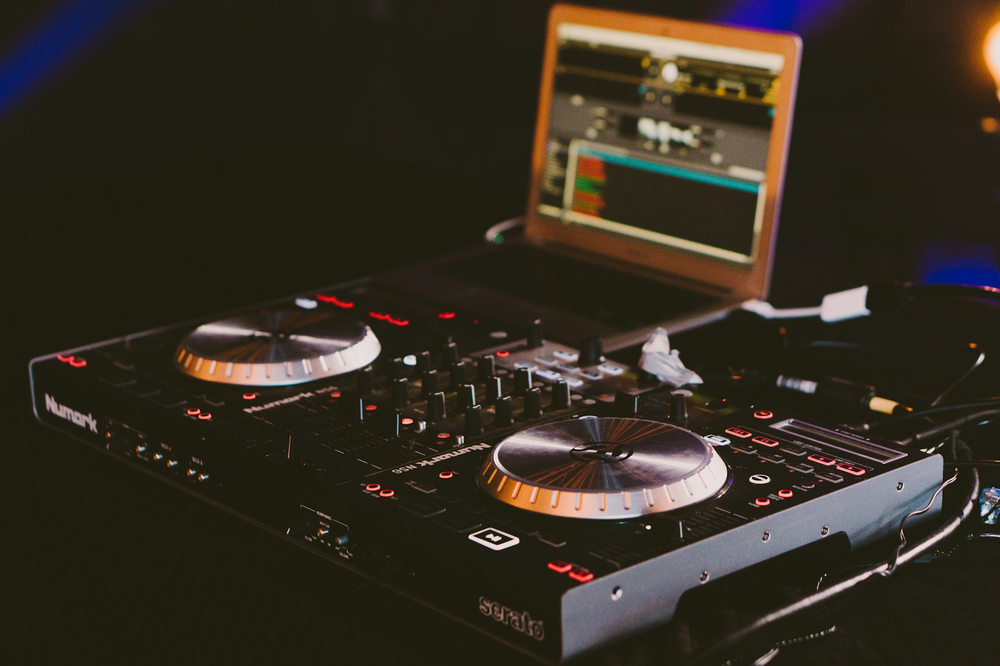

# Abstract Interactive Art Music Mixer

**My Concept:** Users land on the index page of the site, here they will find 6 abstract, differently coloured blobs in the centre of the page, as well as a library of various audio clips beneath them. Users will be prompted to drag and drag an audio clip of their choice onto a blob of their choice, an repeat this to create a unique beat. When the audio is dropped onto the blob, the shape will begin to animate in a unique way (spinning, growing and shrinking, etc.). Each blob will do its own unique animation when an audio clip is dropped on it. The idea is to create a abstract art piece using audio clips.

## Bandarra_Sydney_Music_Mixer
This is a GitHub Repository for MMED-1055 Multimedia Authoring 2 - Music Mixer

## MMED-1055 Mulitmedia Authoring 2 - Music Mixer - Assignment Brief
The focus of this project is to collaboratively research, experiment with and ultimately design and build a multimedia application using design and motion tools as well as HTML, CSS and JavaScript. Your team will implement drag and drop functionality to load audio clips and create a dynamic audio experience, trigger animation, and play a compiled audio track (see [www.incredibox.com](https://www.incredibox.com/) as a reference).

Try to implement this project in sprints - part of an agile workflow best practice. A sprint consists of a scoped mini-project that focuses on one particular deliverable or feature. The work you do lives on a specific branch; everything required to complete that deliverable is done on that branch and then merged to the main branch when finished.

Then it’s on to the next sprint!

## Installation
No installation required
## Usage
Practice fair use. Start with the README.md file, then view [index.html](index.html)

**How to Use the Index Page:**
1. View the Index
2. Drag an audio clip onto the colour blob of your choice and watch it dance.
3. Repeat step 2 on other blobs to mix your music!

### History
Version history is documented through GitHub best practices.
### Contributing
**Syd (Sydney) Bandarra** (they/them)

Student at Fanshawe College, Interactive Media Design, IDP, Fall 2023

Faculty of Creative Industries,

School of Digital and Performing Arts

137 Dundas Street, London, ON N6A 1E9

Student #: 1204224

s_bandarra@fanshaweonline.ca

www.fanshawec.ca 

### Land Acknowledgement 
London, Ontario is located on the traditional lands of the Anishinaabek, Haudenosaunee, Lūnaapéewak and Attawandaron peoples. This land continues to be home to diverse Indigenous peoples, whom we recognize as contemporary stewards of the land, vital contributors of our society, and deserving of sovereignty and reconciliation.
